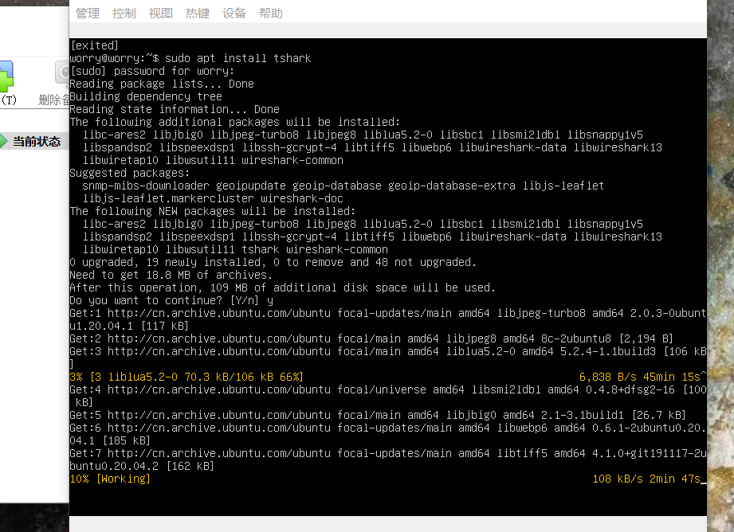
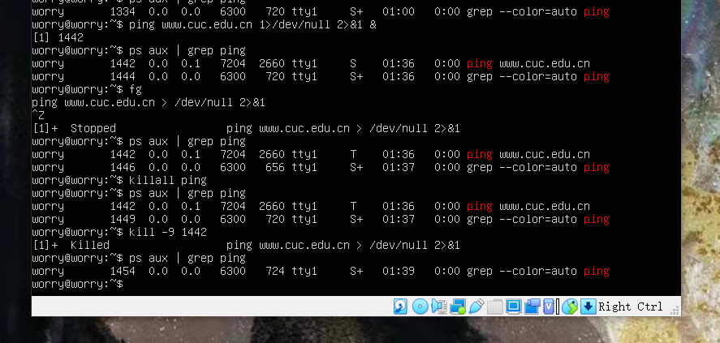

# 实验二：Linux主流发行版本初体验

## 实验目的

* 初次体验linux系统及某些操作；

## 实验环境

* 宿主机：windows10
* 本机linux系统：ubutun 20.04.03 live-server 64bit
* 远程linux系统：阿里云 云起实验室提供的CentOS系统

## 实验要求
* [x] 使用表格方式记录至少 2 个不同 Linux 发行版本上以下信息的获取方法，使用 asciinema 录屏方式「分段」记录相关信息的获取过程和结果
* [x] 【软件包管理】在目标发行版上安装 tmux 和 tshark ；查看这 2 个软件被安装到哪些路径；卸载 tshark ；验证 tshark 卸载结果  
* [x] 【文件管理】复制以下 shell 代码到终端运行，在目标 Linux 发行版系统中构造测试数据集，然后回答以下问题：
  - 找到 /tmp 目录及其所有子目录下，文件名包含 666 的所有文件
  - 找到 /tmp 目录及其所有子目录下，文件内容包含 666 的所有文件
* [x] 【文件压缩与解压缩】练习课件中 文件压缩与解压缩 一节所有提到的压缩与解压缩命令的使用方法
* [x] 【跟练】 子进程管理实验
* [x] 【硬件信息获取】目标系统的 CPU、内存大小、硬盘数量与硬盘容量

## 实验自评
实验完成情况：96%
## 实验过程记录
### 【软件包管理】在目标发行版上安装 tmux 和 tshark ；查看这 2 个软件被安装到哪些路径；卸载 tshark ；验证 tshark 卸载结果  
* ubuntu 20.04 安装tmux`sudo apt update` `sudo apt install tmux`


* ubuntu 20.04 安装tshark `sudo apt install tshark`




* ubuntu 20.04 查找tmux，tshark软件包创建了哪些目录和文件
  - 由于软件包在自动安装时会自动安装相关依赖的软件包，所以先查找tmux，tshark 软件包依赖哪些独立软件包。`apt-cache depends tmux`


  - 然后再使用`dpkg -L`的方式查看


  - 观察安装的目录文件，可以发现一般安装了软件包后，除了有自己的软件目录外还会在man目录下创建自己的使用守则相关文件。
  - 查看相关独立软件包的安装目录如：wireshark-common


* 卸载tshark
   - 删除tshark安装包，不保留配置文件`sudo apt purge tshark`


  如图，命令行提示：此操作会删除所有格式为tshark的文件，但不删除自动依赖下载的其他软件包，如要删除使用`sudo apt autoremove`
   - 输入`sudo apt autoremove`删除依赖安装的软件包


* 验证tshark卸载结果
  - 查看是否有相关文件，验证卸载情况,使用`dpkg -L tshark`显示无该软件；使用`dpkg --get-selections|grep tshark`抓取tshark相关文件，无任何文件；使用`which tshark`查找tshark存储路径，无该文件；综上卸载成功。


[【软件包管理】 Ubuntu 20.04 相关操作](https://asciinema.org/a/475877)

* CentOS操作环境下
 - **CentOS和ubuntu环境不同，下载时运用的命令不同**`yum install tmux`下载tmux，并下载了依附软件包


 - `yum install wireshark`下载tshark，`tshark -v`确认下载成功


 - `yum remove wireshark`卸载tshark


 - `tshark -v`验证该文件已删除

[【软件包管理】 CentOS 7.7 相关操作](https://asciinema.org/a/475944)

### 【文件管理】复制以下 shell 代码到终端运行，在目标 Linux 发行版系统中构造测试数据集，然后回答以下问题：
```

cd /tmp && for i in $(seq 0 1024);do dir="test-$RANDOM";mkdir "$dir";echo "$RANDOM" > "$dir/$dir-$RANDOM";done

```

* Ubuntu 20.04 环境下
  - 执行后输出如下


  - 找到 /tmp 目录及其所有子目录下，文件名包含 666 的所有文件 尝试用find
    `find /tmp -name "*666*"` `find /tmp -type f -name "*666*"`


   `find /tmp -type f -name "*666*"`使用这个可以去除目录名结果，只筛选文件


   `sudo ls /tmp |grep 666` 只会列出文件夹 `sudo ls -R /tmp |grep 666`会列出文件夹和文件。


  `find . -type f |xargs cat |xargs grep 666 `grep就是文本检索，不需要再用cat
  `find . -type f |xargs grep 666`


[【文件管理】 Ubuntu 20.04 相关操作](https://asciinema.org/a/476510)

* CentOS 环境下
  - 找到 /tmp 目录及其所有子目录下，文件名包含 666 的所有文件 尝试用find
    `find /tmp -name "*666*"` `find /tmp -type f -name "*666*"`


  - 找到 /tmp 目录及其所有子目录下，文件内容包含 666 的所有文件
     `find . -type f |xargs grep 666` `find . -type f |grep 666`**注意到有xargs 和没有xargs 的区别** 没有xargs时grep文本检索操作是在当前输出上进行，即对所有文件名检测，当有xargs时，是对所有给出的文件的文件内容，进行文本检索。
     


[【文件管理】 CentOS 7.7 相关操作](https://asciinema.org/a/476516)

### 【文件压缩与解压缩】练习课件中 文件压缩与解压缩 一节所有提到的压缩与解压缩命令的使用方法
* ubuntu 20.04 环境下操作：
  - gzip
    `sudo apt install gzip`确认已自带该软件包


  压缩解压缩文件(原文件会消失，解压时，原压缩文件也消失)`gzip 1.txt`


  压缩解压缩文件夹`gzip -r``gzip -rd`**注:gzip不会直接压缩文件夹，而是将文件目录下的所有文件压缩**


[gzip 压缩解压缩操作 --Ubuntu 20.04](https://asciinema.org/a/475880)

  - bzip2
    `dpkg -L bzip2`确认已自带该软件包


  压缩解压缩文件(**原文件会消失，解压时，原压缩文件也消失**)`bzip2 1.txt``bzip2 -d 1.txt.bz2`


[bzip2 压缩解压缩操作 --Ubuntu 20.04](https://asciinema.org/a/475883)

  > 上述方法只能压缩文件，而不能打包和压缩目录。利用tar可以完成打包压缩目录。

  - **tar**
    通过bzip2的支持进行压缩解压缩文件`tar -jcf testtar.tar.bz2 1.txt 2.txt` `tar -jxf testtar.tar.bz2`
    **由下图可以看到`tar`命令可以打包文件夹，且压缩和解压都不会使原文件消失。**


  通过gzip的支持进行打包压缩解压缩文件`tar -czf testtar-2.tar.gz 1.txt 2.txt` `tar -xzf testtar-2.tar.gz`


[tar 压缩解压缩操作 --Ubuntu 20.04](https://asciinema.org/a/475886)

  - zip
    使用zip可以打包压缩文件和文件夹
    **zip打包压缩解压缩文件后，原文件不会消失，解压用unzip命令**`zip -r test.zip 1.txt 2.txt test` `unzip test.zip`


[zip 压缩解压缩操作 --Ubuntu 20.04](https://asciinema.org/a/475889)

  - 7z
   使用`sudo apt`下载7z时，软件名为7z时，无法找到该软件包，应使用p7zip


   使用7z**可以压缩解压缩文件和文件夹且原文件会消失，但似乎不支持打包文件**
   `p7zip 1.txt 2.txt` `p7zip test` `p7zip -d `


[7z 压缩解压缩操作 --Ubuntu 20.04](https://asciinema.org/a/475890)

  - rar
    rar是私有压缩算法格式，**Linux平台只打包压缩文件或文件夹且原文件不会消失，不能解压缩**
    使用命令`rar a test.rar 1.txt 2.txt``rar a -r test.rar test`


  安装unrar-free，解压缩文件**失败，只能支持rar2.0**


  安装p7zip-rar，使用命令`7z x test.rar`,解压成功且压缩文件保留


[rar 压缩解压缩操作 --Ubuntu 20.04](https://asciinema.org/a/475892)

  - linux下zip解压乱码文件
    将主机的包含中文名的文件传输给虚拟机，然后再解压，解决乱码问题
    由于Ubuntu虚拟机没有中文显示功能，所以使用该方法还是无法显示中文


* CentOS 环境下操作：
  - gzip压缩解压缩操作
    和在ubuntu上的操作一致 `gzip 1.txt` `gzip -r test\` `gzip -d 1.txt.gz` `gzip -rd test\`


[gzip 压缩解压缩操作 --CentOS 7.7](https://asciinema.org/a/476309)

  - bzip2压缩解压缩操作
    值得注意的是：**在unbuntu 20.04 上已自动安装bzip2，但是在centOS上需要先安装**


[bzip2 压缩解压缩操作 --CentOS 7.7](https://asciinema.org/a/476311)

  - zip压缩解压缩操作
    `zip -r test.zip dictionary`可以对目录进行递归打包压缩**可以打包压缩且原文件不会消失**


  zip的解压需要使用unzip，首先要`yum install unzip`安装相应软件包，再`unzip test.zip`解压


[zip 压缩解压缩操作 --CentOS 7.7](https://asciinema.org/a/475951)

  - 7z压缩解压缩操作
  默认Centos7没有安装p7zip安装包，默认源里面也没有这个安装包，需要安装epel源才能安装p7zip安装包。在仅使用`yum install p7zip`时虽然可以下载成功，但是在bash中无法识别p7zip命令或者7z。但是当下载epel源后，再下载就可以使用`yum -y install epel-release` `yum -y install p7zip p7zip-plugins`


  `7z a test.7z 1.txt 2.txt` `7z x test.7z`


[7z 压缩解压缩操作 --CentOS 7.7](https://asciinema.org/a/476320)

  - tar压缩解压缩操作
    和ubuntu上的操作一致`tar -czvf testtar-2.tar.gz 1.txt 2.txt` `tar -xzvf testtar-2.tar.gz` `tar -jcvf test.rar.bz2 1.txt 2.txt`


[tar 压缩解压缩操作 --CentOS 7.7](https://asciinema.org/a/476313)

  - rar压缩解压缩操作
    在centos环境下，rar没有官方自带下载源，所以需要在网站自行下载。
    下载后，执行`rar a test.rar 1.txt 2.txt`操作


    
   - 再使用`unrar e test.rar`操作解压


[rar 压缩解压缩操作 --CentOS 7.7](https://asciinema.org/a/477131)

  - linux下zip解压乱码文件
    将本机windows中文名文件压缩包发送至云计算机


  接着先普通命令解压 `unzip chinese.7z`，显示为乱码，后使用`unzip -O cp936 chinese.7z` **注意-O，是大写的O**成功显示出中文字符


[linux下zip解压乱码文件 --CentOS 7.7](https://asciinema.org/a/477136)

### 子进程管理实验
* ubuntu 20.04环境下。
  - `ping www.baidu.com`,用`ctrl c`可以中止


  - `ping www.baidu.com &`把ping进程放到“后台”执行,此时终端不断被“涌出”的ping输出结果“污染”
  此时单独使用CTRL-C无效
  `fg` `CTRL-C`一起操作可以终止该ping进程


  - 把ping进程放到“后台”执行，把标准错误输出先重定向到标准输出，然后再把标准输出重定向到“黑洞”文件
  `ping www.baidu.com 1>/dev/null 2>&1 &`
  查看进程会发现ping在“后台”一直运行着
  `ps aux | grep ping`
  `ping www.cuc.edu.cn 1>/dev/null 2>&1 &`
  杀死所有ping进程
  `killall ping`


  - 注意CTRL-Z的作用，被CTRL-Z的进程在ps aux中的进程状态如何显示的
    如下图所示：被CTRL-Z的进程在ps aux中的进程状态任然处于运行中，只不过它的运行中止了，但是进程并没有关闭。而且此时使用`killall ping`无法结束进程。必须使用`kill -9`。者也暗示了普通的`kill`操作无法结束中止的进程。



[子进程管理实验 --Ubuntu 20.04](https://asciinema.org/a/475893)

* CentOS 系统环境下
- `ping www.baidu.com`,用`ctrl c`可以中止


  - `ping www.baidu.com &`把ping进程放到“后台”执行,此时终端不断被“涌出”的ping输出结果“污染”
  此时单独使用CTRL-C无效
  `fg` `CTRL-C`一起操作可以终止该ping进程


  - 把ping进程放到“后台”执行，把标准错误输出先重定向到标准输出，然后再把标准输出重定向到“黑洞”文件
  `ping www.baidu.com 1>/dev/null 2>&1 &`   `ps aux | grep ping`查看进程会发现ping在“后台”一直运行着    `killall ping`杀死所有ping进程，进程结束关闭。如果CTRL-Z进程，则使用`killall ping`无法成功将进程关闭，使用`kill -9 `可以关闭进程。
 


[子进程管理实验 --CentOS 7.7](https://asciinema.org/a/476323)

### 【硬件信息获取】获取目标系统的 CPU、内存大小、硬盘数量与硬盘容量

* ubuntu 20.04下进行查看
  * 使用`cat /proc/cpuinfo |grep "model name" && cat/proc/cpuinfo |grep "physical id"` 查看cpu


  该ubuntu 20.04虚拟机下只有一个单核cpu。
  * 验证信息是否正确，在Virtual Box中查看属实。


  * 使用命令` cat /proc/meminfo |grep MemTotal`查看内存大小；使用`sudo fdisk -l |grep Disk`查看硬盘大小（fdisk需要访问权限，加上`sudo`提升权限）。


  内存大小：2030972 KB
  硬盘：VirtualBox里现有6个虚拟硬盘，正在使用的虚拟硬盘内存是80GB


[【硬件信息获取】 --Ubuntu 20.04](https://asciinema.org/a/475894)

* CentOS 下进行查看
  使用与Ubuntu 20.04 一样的操作`cat /proc/cpuinfo |grep "model name" && cat/proc/cpuinfo |grep "physical id"` ` cat /proc/meminfo |grep MemTotal` `fdisk -l |grep Disk`


[【硬件信息获取】 --CentOS 7.7](https://asciinema.org/a/475948)

## 遇到的问题及解决方法

* install tmux 报错：确实目标文件
  - 搜索在ubuntu20.04 上linux系统中 tmux属于哪一类软件包


  查看ubuntu官网，可知tmux 属于focal类软件包，也就是说是官方版本的软件。

[Binary package “tmux” in ubuntu focal](https://launchpad.net/ubuntu/focal/+package/tmux)

  - 也就是说问题很有可能是指令输入错误。输入`sudo apt install tmux`就成功下载了
  - 下载过程中出现下图情况，`CTRL c`退出后，重新install，提示已经下好


* 使用`gzip -r`压缩目录，目录没有显示被压缩


  进入该目录，`ls`查看目录下文件，发现文件已被压缩，搜素文献后知道了gzip无法直接压缩目录。
* 安装unrar-free后，无法解压压缩文件
  命令行显示:未知的存档形式，只能用于rar2，0版本。


  于是查看rar的version


  思考可能是版本号的原因，试用另外一种`p7zip-rar`软件尝试解压，解压成功！
*  linux下zip解压乱码文件,老师的代码无效`unzip -O cp639`


  此操作可以执行，原因应该是在该虚拟机下无法识别中文字符，所以在CentOS下进行实验，可以成功解决windows中文文件在linux系统解压后出现乱码的问题。

* 在centos环境下，rar没有下载源，不能直接使用`yum install`命令下载。
  - 在官方网站下载，因为云端的CentOS系统是linux64，所以选用linux x64的链接下载。**使用下载链接时，--no-check-certificate**
  ```

  wget --no-check-certificate http://www.rarlab.com/rar/rarlinux-x64-5.3.0.tar.gz
  tar -xzvf rarlinux-x64-5.3.0.tar.gz 
  cd rar
  make

  ```
  - 下载后要解压下载得到的压缩包，检查下载成功。


* CentOS上command not found apt


  原因是：在CentOS操作系统上支持 `yum install`
  一般来说著名的linux系统基本上分两大类：
  1.RedHat系列：Redhat、Centos、Fedora等
  2.Debian系列：Debian、Ubuntu等

* CentOS安装tshark，`yum install tshark`操作找不到下载源
  看下图可知，使用`yum what provides *tshark*`可以看到wireshark软件包下包含看tshark。


  所以使用`yum install wireshark`即可

*  如何对目录子目录关键词检索 
   - 首先文本检索肯定与grep操作有关，再结合管道和xagrs的功能，对问题有了大致的解决思路。
   - 查看目录及子目录所有文件，这个操作联想到 ls，再结合管道操作，grep文本抓取，就有了`ls /tmp | grep 666` 和`ls -R /tmp |grep 666`的想法，之后又学习了find操作，找到了更简便的方法。
  
*  如何对目录子目录文件内容进行关键词检索
  -   `sudo cat /tmp |grep 666` `sudo cat /tmp |xargs grep 666` cat 后必须接指定文件名。


  - 找到 /tmp 目录及其所有子目录下，文件内容包含 666 的所有文件  
  单独用find似乎无法查看列出文件内容。尝试 xargs 结合 find 使用
  想法：先列出所有文件，依次cat，grep 666 
  - `sudo cat /tmp |grep 666` `sudo cat /tmp |xargs grep 666` `sudo ls -R /tmp |xargs cat |xargs grep 666`
  - ls -R的直接输出结果无法直接与cat 命令连接


  - ls cat 也不行，ls列出的是文件目录，不是文件名


 `find . -type f |xargs cat |xargs grep 666 `grep就是文本检索，不需要再用cat
 所以直接`find . -type f |xargs grep 666 `就好了

## 参考文献
* [Binary package “tmux” in ubuntu focal](https://launchpad.net/ubuntu/focal/+package/tmux)
* [获取linux硬盘空间总数命令,linux查询内存、CPU、硬盘等系统信息的命令](https://blog.csdn.net/weixin_42109925/article/details/116553434)
* [linux下文件和目录的压缩和解压（gzip、bzip2、tar）](https://blog.csdn.net/tomatolee221/article/details/84963433)
* [CentOS执行apt-get提示不存在](https://www.cnblogs.com/li-mei/p/10387955.html)
* [CentOS安装tshark抓包工具](https://www.cnblogs.com/alog9/p/11805716.html)
* [centos 安装rar](https://blog.csdn.net/qq_21956483/article/details/79287244)